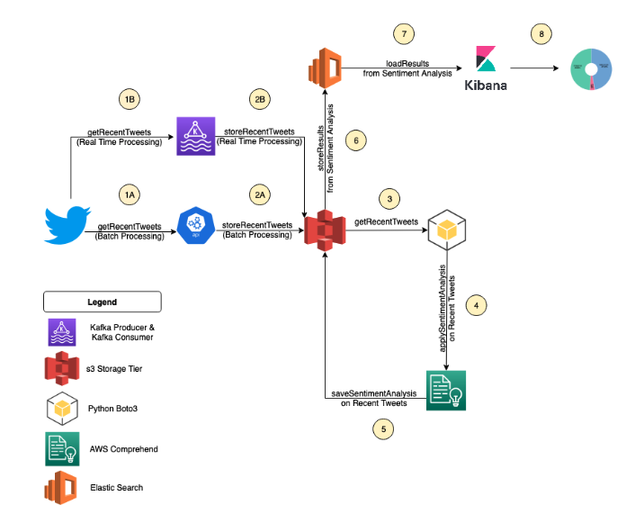
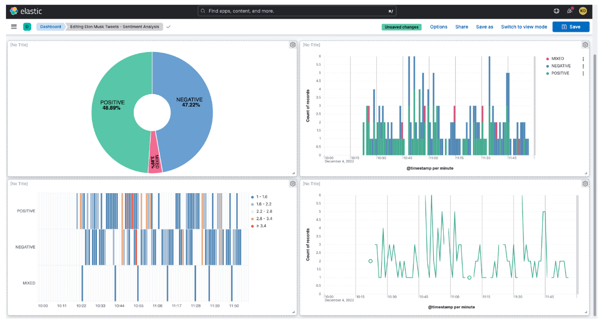

# CSCI-E-88-Final-Project
Final Project Submission for CSCI E-88 Final Project for Ruchi Asthana and  Kemi Olateju

## Problem Statement
Elon Musk is a South African-born American entrepreneur who co-founded large companies like PayPal and SpaceX, and is currently the CEO of Tesla and Twitter. His recent purchase of Twitter has been especially controversial, affecting not just Musk’s reputation but also the global economy.

Among the many Elon Musk controversies associated with the Twitter acquisition is the massive layoff that started in mid-November, resulting in half of its employees losing their jobs. 
Based on media outlets, it seems like working conditions for the remaining employees are also bleak as many have to work 80 hours a week and come in and have to work from the office. Our team is interested to see if the sentiment on Twitter matches the negative sentiment towards him in the media and press. We will specifically dive deep into the positive and negative sentiments associated with #elonmusk from the past week. 

We hypothesize that the overall sentiment of tweets will be generally negative, as there is still a lot of frustration associated with the recent Twitter layoffs. 

We will leverage different Big Data Processing frameworks to extract Tweets that reference Elon Musk and analyze the sentiment associated with them. We will then create visualizations in an attempt to understand trends over the last week to answer our proposed hypothesis. 

## YouTube Video URL

https://youtu.be/CdzAkxTHQlo  

## Processing Pipeline 

### Architecture diagram 

### Data Source 
We used the GET /2/tweets/search/recent API to pull up to 20,000 Tweets about #elonmusk. We leveraged this API because it was one of a limited number of APIs available for standard OAuth credentials. We also chose this dataset because the data from this API will tell us if the majority of recent Tweets have a POSITIVE or NEGATIVE sentiment. 

### Distributed Deployment

Docker containers were leveraged for seamless and consistent deployment of Apache Kafka clusters between different users and devices. 

### Collection & Message Tier

We chose to use Apache Kafka as our stream processing platform because of its low latency and high throughput capabilities. A Kafka producer was used to generate messages from our data stream source (Twitter APIs), and we published them using a Kafka consumer to Amazon s3. 

### Master storage tier

We chose Amazon s3 for our storage layer primarily for its high data availability, scalability, and performance capabilities. It was also easy to use and accessible through the various other technologies deployed.

### Sentiment Analysis

We leveraged AWS Comprehend for sentiment analysis of individual Tweets. We chose AWS Comprehend because it is a state-of-the-art natural language processing tool for finding insights in text. It especially excels in extracting key phrases, people, and brands, as well as understanding how positive or negative a text is. For each tweet passed into AWS Comprehend, we collected the overall sentiment (POSITIVE, NEGATIVE, NEUTRAL, or MIXED) along with the numerical positive sentiment score and negative sentiment score. Our analysis was primarily conducted on the categorical sentiment field; however, there are natural extensions of this work that could involve the numerical sentiment scores as well. 

### Distributed Indexing/Search

We leveraged the Elasticsearch cloud for a portion of our data analysis to process the results of the sentiment analytics and filter out the NEUTRAL sentiments. We chose Elasticsearch for its ability to handle JSON format files natively and full-text search engine capabilities at speed.   

### Visualization

We chose Kibana for our data visualization capabilities of its seamless integration with Elasticsearch. Within Kibana, we focused primarily on visualizations for categorical variables, including pie charts and bar graphs over a period of time.
We used Github for code sharing, version control, and collaboration.

## Conclusions

We were able to isolate 2000 tweets related to #elonmusk between the hours of 10.22 am and 11.55 am eastern timezone. Of these tweets, only about 10% were labeled by our sentiment analyzer as either NEGATIVE, POSITIVE or MIXED - with the remaining tweets having a NEUTRAL sentiment. Overall for this snapshot in time, we observed that the sentiment towards Elon Musk was quite balanced. 
**These results contradict our hypothesis that the overall sentiment of tweets will be generally negative, as there is still a lot of frustration associated with the recent Twitter layoffs.** 		